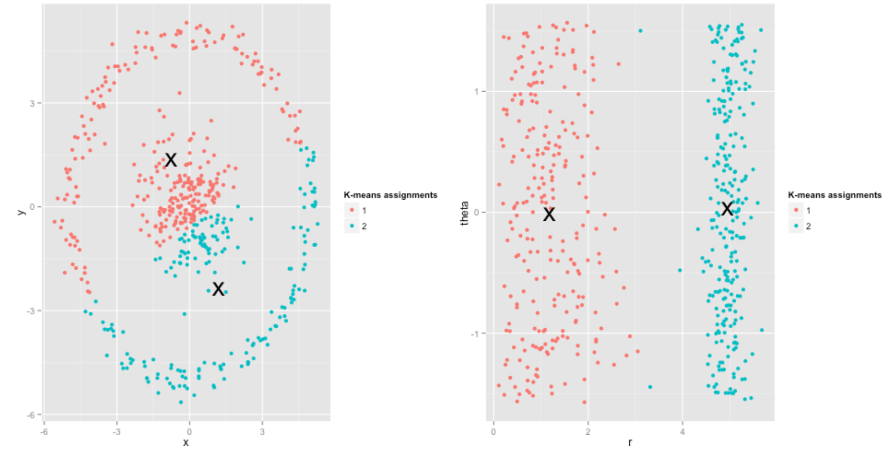
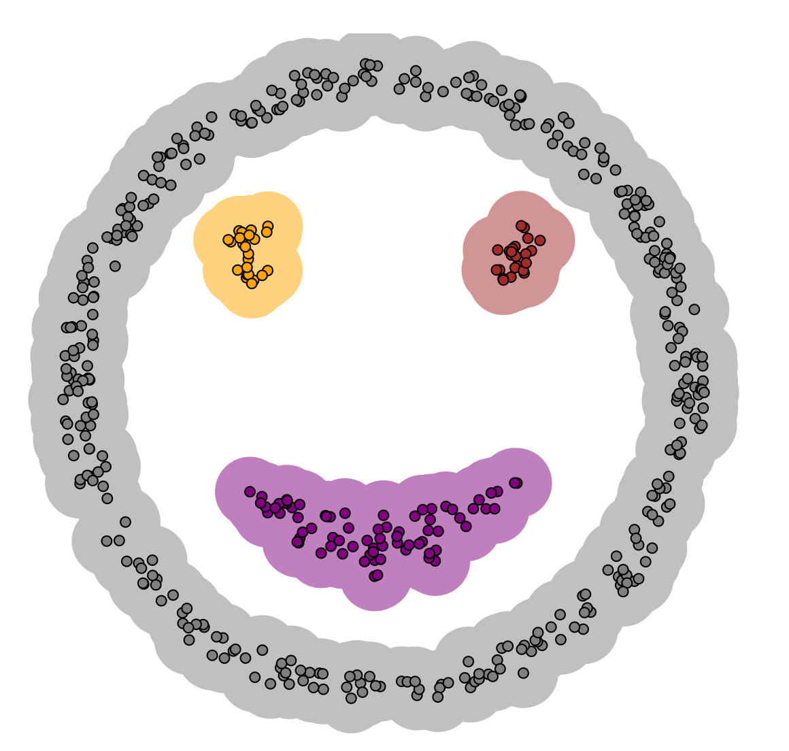
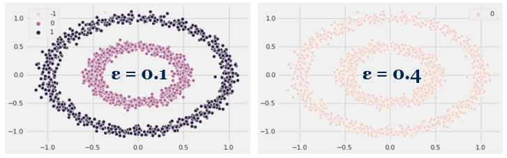

The task of grouping data points into groups (clusters) such that points in a group are more ‘similar’ to each other than to points outside the group is called clustering. But how does one know if a data point is similar to another point or not? This act of defining similarity is what distinguishes various clustering methods from each other — K-Means defines similarity by the closeness of a data point to the centroid of the clusters while DBSCAN defines similarity by grouping together data points that are within the same density region.
In this article, we’ll take a look at these two clustering methods that are often used in unsupervised machine learning and implement them in Python. So let’s get started!

## K-Means
The K-Means clustering algorithm is a type of hard clustering — a data point can belong only to one cluster completely (as opposed to a soft clustering method in which each data point is assigned a probability or likelihood to be in a given cluster).
The K-Means algorithm iterates through the following steps:
1. **Specify the desired number of clusters K**.
2. **Initialize K cluster centroids** in some fashion. The centroids are not necessarily data points themselves but can be generated within the data domain.
3. **Assign each data point to its closest cluster centroid**. ‘Closest’ is defined by minimizing the Euclidean distance (or L2 norm), which is the square root of the sum of the squared vector values (think Pythagorean theorem in 2D).
4. **Reassign K cluster centroids** by calculating the mean of all points within each cluster and setting the new centroid values as that.
5. **Calculate the distance** each centroid changed from its previous value
6. **Repeat steps 3, 4, and 5** until the distance each centroid changes drops below a predefined threshold or until a predefined number of iterations has been reached.

### K-Means Assumptions and Limitations
It is important to note that K-Means reduces the within-cluster sum of squares, or the variance of the observations within each cluster. In other words, a cluster that has a small sum of squares is more compact than one with a large sum of squares. Furthermore, as the number of observations within a cluster increases, the sum of squares becomes larger. As a result, **K-Means works best when the data points are organized in convex, spherical clusters and contain roughly the same number of points within each cluster**.

In the figure below, whereas K-Means struggles clustering into two groups with the data points on the left, transforming the dataset from Cartesian to polar coordinates results in reasonable cluster assignments. Therefore, **an important insight is to visualize and understand your dataset before applying a clustering algorithm to it**.
 *Source: http://varianceexplained.org/r/kmeans-free-lunch/*

Also, since K-Means requires the number of clusters to be predefined, choosing the correct value for K is important but also difficult, especially when you cannot visualize all the dimensions in your dataset. However, you can use either the [Elbow Method](https://en.wikipedia.org/wiki/Elbow_method_(clustering)) or the [Silhouette Method](https://en.wikipedia.org/wiki/Silhouette_(clustering)) to determine the best choice of K when the number of clusters to choose is not clear.

## DBSCAN
[Density-Based Spatial Clustering of Applications with Noise](https://www.aaai.org/Papers/KDD/1996/KDD96-037.pdf) or DBSCAN, for short, was proposed in 1996 and organizes clusters based on the density of points and unlike K-Means, determines the number of clusters to be generated without user input. Furthermore, DBSCAN allows us to classify noise (unlike K-Means) by defining noise as areas with lower density points than clusters. For example, whereas K-Means struggles with the following distribution, DBSCAN is able to correctly identify the clusters based on the density of points.
*Source: https://www.naftaliharris.com/blog/visualizing-dbscan-clustering/*

There are two key ideas / hyperparameters in DBSCAN — *MinPts* and *Eps*:
1. For each point in a cluster, there have to be at least a specified minimum number of points (MinPts) in its neighborhood, i.e. the density in the neighborhood has to exceed some threshold. The parameter MinPts primarily controls how tolerant the algorithm is to noise.
2. Neighborhood is defined as the space around a point (Eps) and its shape is determined by the chosen distance function, i.e. when using the Manhattan distance in 2D space, the shape of the neighborhood is rectangular. Similarly to K-Means, the most common distance function used for DBSCAN is Euclidean distance.
Using these two hyperparamters, DBSCAN categorizes the data points into three categories: core points, or points inside of the cluster, border points, or points on the edge of the cluster, and noise, or points that do not belong to any cluster.

### DBSCAN Assumptions and Limitations
Because the parameter Eps controls the local neighborhood of the data points and influences cluster assignment, it is crucial to choose it appropriately and it usually cannot be left at the default value. If set too large, clusters will merge into one another, eventually returning one cluster if Eps is large enough. If set too small, most data points will not be clustered at all or be categorized as noise. The importance of choosing the right value of Eps is demonstrated in the figure below.

Furthermore, DBSCAN struggles with datasets containing clusters with largely varying densities, as the parameters Eps and MinPts cannot be customized for each cluster. And for high-dimensional data, the standard choice of Euclidean distance suffers, which makes it challenging to find an appropriate value for Eps. Therefore, it is worth repeating as for K-Means, **it is important to visualize and understand your dataset before applying a clustering algorithm to it**.

## Implementation
[Refer to the following notebook](https://github.com/jissac/ScratchML/blob/master/Clustering.ipynb) for a from-scratch Python implementation of K-Means and DBSCAN, followed by a comparison with the popular Scikit-Learn implementation of the algorithms. Hope it helps you understand the inner workings of these two algorithms and the assumptions behind each!

## Summary
In conclusion, K-Means and DBSCAN are two powerful algorithms to use when you have an unlabeled dataset that needs to be clustered into groups. However, **remember to be mindful of the assumptions underlying the model you choose** — understanding your dataset and preprocessing it are essential in order to get correct predictions from your models. Also, be sure to read the Scikit-Learn clustering documentation to learn about other clustering algorithms!

## References / Helpful Links:
- https://scikit-learn.org/stable/modules/clustering.html
- https://support.minitab.com/en-us/minitab/18/help-and-how-to/modeling-statistics/multivariate/how-to/cluster-k-means/interpret-the-results/all-statistics-and-graphs/
- https://www.aaai.org/Papers/KDD/1996/KDD96-037.pdf