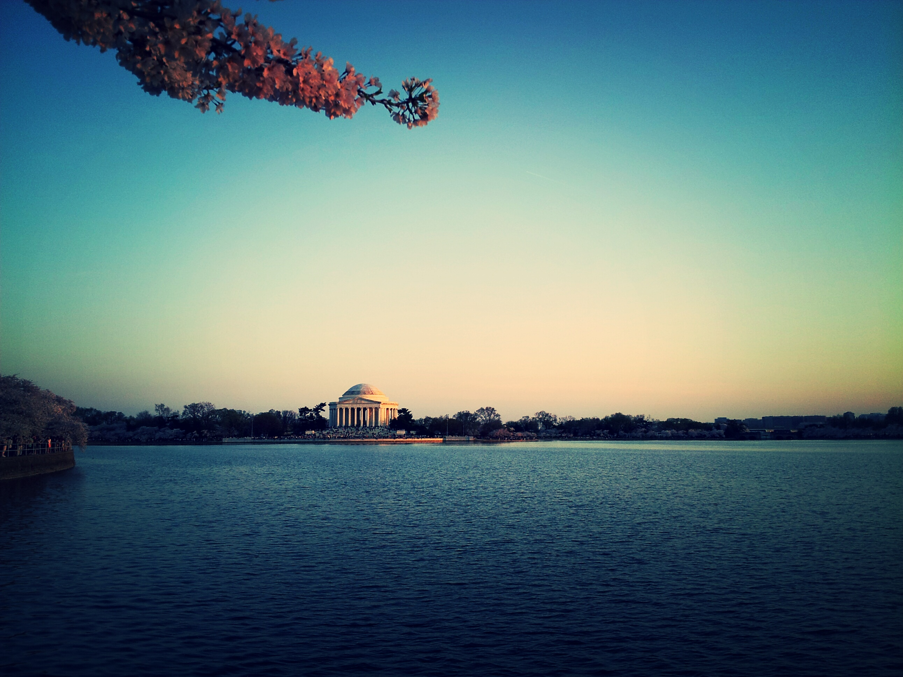

In 1912, Mayor Yukio Ozaki of Tokyo gifted 3,000 cherry trees to the city of Washington, DC as a sign of friendship between the US and Japan. Today, the National Cherry Blossom Festival attracts more than a million people each year who come from all over the world to admire the flowering cherry trees.

In light of this amazing history, a few friends and I decided to travel to DC and experience the cherry blossom bloom first-hand. It was packed! I’ve visited DC before, but this time, the city was overflowing with people. We had to wait over an hour just to get a sandwich from a food-truck. But being able to share this moment with so many people as we all enjoyed the blooming trees was surreal. My favorite part was watching the sun set over the Potomac River (pictured above), its golden beams dancing in between the blossoming cherry trees.

How do you respond when you encounter beauty in something as simple as a flowering tree? Perhaps all you can do is simply be in awe.

Thank you Japan for this beautiful, living memorial.

