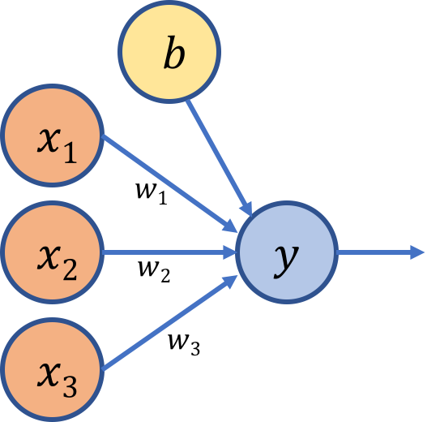
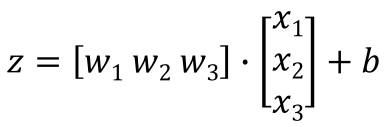
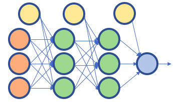
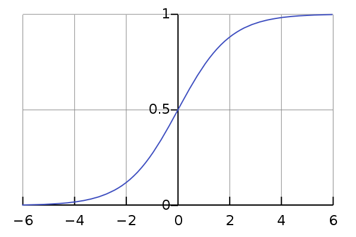
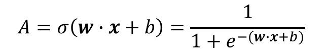

Over the past few decades, the digitization of our society has led to massive amounts of data being stored. Combining this increase in the scale of stored information with advances in hardware computational power and algorithmic innovations, the field of artificial intelligence (AI) has jumped into the spotlight as machines seem to possess the ‘magical’ ability to learn without being told explicitly what to do. 

Examples of impressive feats performed by machines include: AlphaGo defeating 9dan rank Go champion Lee Sedol, self-driving cars navigating city streets, and a computer learning to beat Super Mario World by itself. At the heart of such systems have been algorithms called deep neural networks that can model the non-linearities inherently present in image, audio, and video data.

So… why is this important?

My goal in this article is to convince you that these recent advances in AI aren’t the purview of a select few but that if you’re interested, you too can learn about and contribute to this amazing field. We’ll start by peeling back the layers of abstraction surrounding deep neural networks and begin by using logistic regression as our first principle starting point (had to start somewhere!). I’ll assume you have basic knowledge of matrix math([dot products](https://www.youtube.com/watch?v=LyGKycYT2v0)), calculus ([partial derivatives](https://www.youtube.com/watch?v=AXqhWeUEtQU)), probability theory ([conditional probability](https://www.youtube.com/watch?v=JGeTcRfKgBo)), and [Python programming](https://www.codecademy.com/learn/learn-python). If not, do not fear! Follow the links above and keep learning — if you have an internet connection and an unyielding thirst for knowledge, be patient with yourself and you’ll soon be slaying all the proverbial giants. I’ve linked references and resources at the end as learning aids — after all, standing on shoulders is a great way to see further ahead.

So, by understanding how logistic regression can be modeled as a single neuron you’ll understand fundamental deep learning concepts like **weights**, **activation functions**, **loss functions**, **gradient descent**, **learning rate**, **training**, **forward and backward propagation**, and **prediction**. You’ll then be able to move on to more advanced topics that link many neurons together into deep networks — like Convolutional Neural Nets (CNNs), Generative Adversarial Nets (GANs), and Recurrent Neural Nets(RNNs), to name a few. So let’s get started!

## A Neuron
Let’s use the word ‘neuron’ to describe a function that looks like this:

You have inputs and you have an output (this a 1-layer neural net — by convention we don’t count the initial raw inputs as a layer). If you squint hard enough, it even sort of looks like a [human neuron](http://s4.thingpic.com/images/E6/BdHJAWutQ3E5zkvcgFz8Kk8x.png). This function is defined as a weighted sum of its inputs — we multiply the inputs ***x*** by variables ***w*** called weights to get the output. You can think of weights as the strengths of the connections between input and output — for example, if *w1* has a higher value than *w2*, that implies that the input x1 influences the output more than *x2* does. The value *b* is called the bias term (it isn’t multiplied by a weight) and is responsible for shifting the function so that it’s not constrained to the origin. Representing the function in matrix form yields:

The shape of the matrix *w* is determined by the number of units in the layer you’re mapping to and the number of units in the layer you’re mapping from— hence the shape [1 x 3] because the output layer has 1 unit and the input layer has 3 units (not counting the bias term). This looks a lot like the equation for a line:

However, the strength of a neural network lies in its ability to model complex nonlinearities. Even if you link many of these units together in a deep network (the green units are called hidden layers) as shown below,

the composition of many linear functions is itself a linear function. So our journey is not yet complete — how can the function model the non-linear patterns present in the input data in such a way that it can predict, with high accuracy, similar patterns in data it has never seen before?

To model a non-linear problem, we will need to introduce a nonlinear activation function.

## The Sigmoid Function
Let’s define a function called sigmoid. It has a probability distribution that looks like this:

The equation for a sigmoid function is:

The sigmoid activation function converts its input to a value between 0 and 1 — as z increases towards positive infinity the output gets closer to 1, and as z decreases towards negative infinity the output gets closer to 0. Going back to our example of a single neuron, we can feed our function *z = wx + b* as an input to the sigmoid activation function, which yields:

Where the variable A represents the sigmoid activation function. Showing it pictorially using our single-layer representation of a neuron:

So how is this valuable? Stacking nonlinearities on nonlinearities in a deep network allows us to model very complex relationships between inputs and outputs. Even in the case of our single neuron above, let’s see how adding a nonlinear activation function can be useful.

## Logistic Regression
[Logistic regression](https://en.wikipedia.org/wiki/Logistic_regression) is a binary classification method. For example, after being trained on images of cats and dogs and then being given a picture that it has never seen before of a cat (y=0) or a dog (y=1), can the machine predict the correct type? As we’ll see, even a simple algorithm like logistic regression can do surprisingly well.
We want to model a function that can take in any number of inputs and constrain the output to be between 0 and 1. Where have we seen that before? You guessed it — our humble neuron, armed with the sigmoid activation function, boldly comes in to save the day! Now is there a way to measure how good our predicted output is compared to the true label?

### Loss Function and Cost Function
Let’s define *y* as the true label (y = 0 or y = 1) and *y_hat* as the predicted output (or the probability that y = 1 given inputs w and x). Therefore, the probability that y = 0 given inputs *w* and *x* is (1 - *y_hat*), as shown below.

## Practical Example
Alright, enough theory, time for application! Remember the cat vs. dog classification problem — given an image of either a cat or a dog, will the computer be able to classify it as one or the other? Let’s implement a single layer neural net representation of logistic regression from scratch using Python. We’ll use Kaggle’s dogs vs. cats dataset and build the model step by step: I’ve created a [Github repository called ScratchML that contains the CatsvsDogs_Logistic_Regression Jupyter notebook](https://github.com/jissac/ScratchML). We’ll go through preparing and pre-processing the data (often the most time-consuming part of the journey) and then define and run our model. Try to understand what each method does and how the formulas above are being implemented. Then re-write them yourself in order to build your intuition.
After training and running the model, our humble representation of logistic regression managed to get around 69% of the test set correctly classified — not bad for a single layer neural network! Using cutting edge architectures will yield world-class results — but they are built using much of the same principles we learned implementing logistic regression.
## Now what?
As is the nature of learning, we’ve only scratched the surface. We’ve covered a general overview of the major concepts, but there are yet many more topics to learn such as implementing regularization to prevent overfitting of the data, other activation functions (ReLU, tanh, etc.), stochastic gradient descent (SGD), k-fold cross validation, to name a few.

I’ve put together a [list of machine learning resources](https://github.com/jissac/Machine-Learning-Resources) that should get you started on your journey. Keep learning and implementing what you learn, after all, it’s an iterative process! Happy descent — may you reach the optimum point! :)
## Resources:
- http://www.deeplearningbook.org/contents/optimization.html
- https://www.coursera.org/learn/neural-networks-deep-learning
- http://cs231n.github.io/neural-networks-1/
- https://stats.stackexchange.com/questions/213325/neural-network-meaning-of-weights
- https://stackoverflow.com/questions/2480650/role-of-bias-in-neural-networks