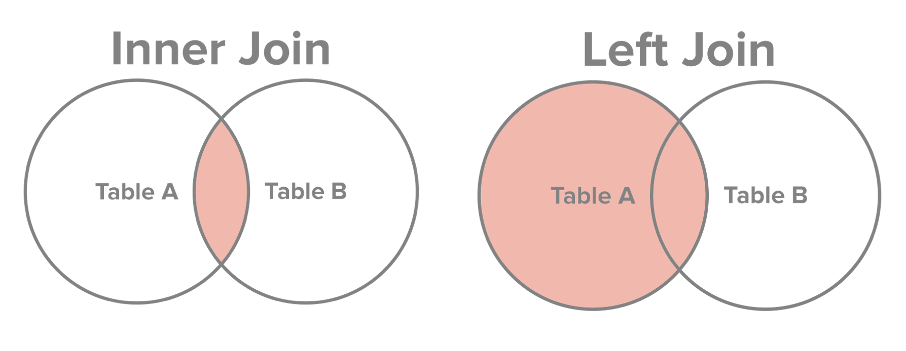

Given the rise of ‘big-data’, effectively managing and working with that stored data becomes very important — you’re only able to ask better questions if you can quickly glean insights from the data you have.
Unlike smaller datasets that can fit easily into a local computer’s hard disk, big data by definition won’t fit into local storage and must instead be stored in a database — a structured set of information that can be queried, accessed, and updated in various ways.
A database management system (DBMS) is the software that the end-user interacts with to use the database. To access the DBMS and database, we use a language called Structured Query Language (SQL) which provides a codified way to communicate with the DBMS and modify data stored in the database. SQL can be used to query and process data from DBMS tools like SQLite or Postgres or from the Hadoop Distributed File System (HDFS) using SQL-like languages like HiveQL or Spark SQL, for example.
## Basic SQL Query
In the SQL workflow, most of the time is spent writing requests (queries) that fetch a subset of or edit values from tables contained in the database. An example query looks like:
```SQL
SELECT *       
FROM table_name         
LIMIT 5;     
```
Breaking down the statement above,         
`SELECT *:` selects which columns we want (* denotes all the columns)      
`FROM table_name:` the table we want to query (`table_name`)        
`LIMIT 5:` the number of rows we want (first 5 in this case)

To filter rows by a specific criteria, we use the `WHERE` statement.
```SQL
SELECT * 
FROM table_name
WHERE column_name > 0.5
LIMIT 5;
```
A `WHERE` statement contains three things:
- The column name we want to filter on (column_name)
- A comparison operator (<,≤,>,≥,=,!=)
- The value we want the database to compare each value to (0.5 in this case)

We can also use a conditional operator like `AND` or `OR` to further filter our results and the `ORDER BY` clause to order our results by ascending (`ASC`) or descending (`DESC`) order.
```SQL
...
WHERE [condition1] AND [condition2]
ORDER BY column_name DESC;
```
## Summary Statistics
We can use SQL to code and execute summary statistics like mean and standard deviation and aggregate functions like count, max, and min. We can also use the alias syntax AS to temporarily rename a table or a column in a query and the `DISTINCT` keyword in conjunction with the `SELECT` statement to fetch only the unique records and disregard duplicates. The query below, for example, aggregates all the unique values of `col1` in `table_name`(which has been renamed as `table_alias_name`), renames `col1` as `col_alias_name` and returns the row count.
```SQL
SELECT COUNT(DISTINCT(column_name)) AS col_alias_name
FROM table_name AS table_alias_name
WHERE [condition1];
```
## Grouping
The `GROUP BY` clause allows us to further compute summary statistics by combining identical data into groups. It follows the `WHERE` clause and precedes the `ORDER BY` clause. To place conditions and filter on groups created by the `GROUP BY` clause, we can use the `HAVING` clause.
```SQL
SELECT col1_name, ROUND(AVG(col2_name) / AVG(col3_name), 3) AS percentage 
FROM table_name
WHERE [condition1]
GROUP BY col1_name 
HAVING percentage > .8
ORDER BY percentage;
```
Oftentimes it’s useful to know the type of each column when doing arithmetic — this can be done using the `PRAGMA TABLE_INFO(table_name)` command. And if we want to cast a column as a specific type, we can use the `CAST` clause:
```SQL
SELECT CAST(col1_name as Float) / CAST(col2_name as Float) AS alias_name
FROM table_name
LIMIT 5;
```
## Subqueries
Unlike imperative, object-oriented programming languages like Python or C++, SQL doesn’t have variables you can define and use. Instead, SQL is a declarative programming language where we focus on expressing computations instead of defining how to do them. So since we can’t assign variables, we’ll have to use something called subqueries, or a query nested within another query. Subqueries must be enclosed within parenthesis and can be used within the `WHERE` clause:
```SQL
...
WHERE column_name OPERATOR
   (SELECT AVG(column_name)
    FROM table_name);
```

or within the `SELECT` clause:
```SQL
SELECT COUNT(*), (SELECT COUNT(*) FROM table_name)
FROM table_name 
WHERE [condition];
```
or within both the `WHERE` and `SELECT` clauses:
```SQL
SELECT COUNT(*), (SELECT COUNT(*) FROM table_name)
FROM table_name 
WHERE column_name OPERATOR
   (SELECT AVG(column_name)
    FROM table_name);
```
## Joining Data
Data will often be spread across multiple tables and in those cases, joining datasets together is often the first thing to do before doing analysis. In SQL, the JOIN clause combines data from two tables by using values common to each. The most common way to join data using SQL is by using an `INNER JOIN`:
```SQL
SELECT * 
FROM table_name1
INNER JOIN table_name2
ON [join_constraint]
```
An `INNER JOIN` won’t include any rows where there isn’t a mutual match from both tables — in this way we could end up losing data that is only present in one table. One solution is to use a `LEFT JOIN`, which includes all the rows from the left (first) table that are not selected with the `INNER JOIN`.
```SQL
SELECT col5_name 
FROM table_name1
LEFT JOIN table_name2
ON table_name2.col1_name = table_name1.col3_name
```
The figure below shows the difference between `INNER JOIN` and `LEFT JOIN`.
*Source: http://www.sql-join.com/sql-join-types/*

## Creating Tables
To add tables in a database, we use the `CREATE TABLE` clause.
```SQL
CREATE TABLE table_name (
    column1_name column1_type,
    column2_name column2_type,
    column3_name column3_type,
    ...
);
```
Data types define what type of data a column can contain. There are many different types you can choose from including, `TEXT`, `NUMERIC`, `INTEGER`, `FLOAT`, `BLOB`, many others.
If you make a mistake creating a table using the command `DROP TABLE table_name` will delete the created table. You can use the dot command `.schema table_name` to view the schema for the table you created and you can use the `ALTER` command to add, delete, or modify columns in an existing table.

*I hope this gets you started on your SQL journey. As always, there’s much more to learn and queries can become quite complicated. However, these basics will guide you as you practice — so here’s to more querying!*
## Resources:
- These are my notes from the excellent DataQuest learning track. Check them out and subscribe at www.dataquest.io
- For a complete list of SQL commands, check out: https://www.tutorialspoint.com/sqlite
- A SQL style guide: https://www.sqlstyle.guide/