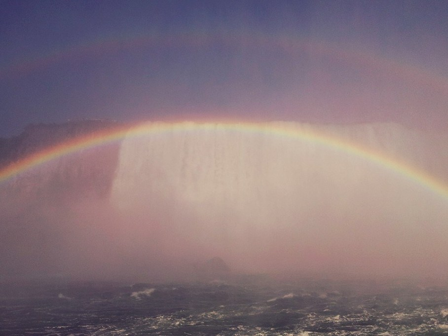
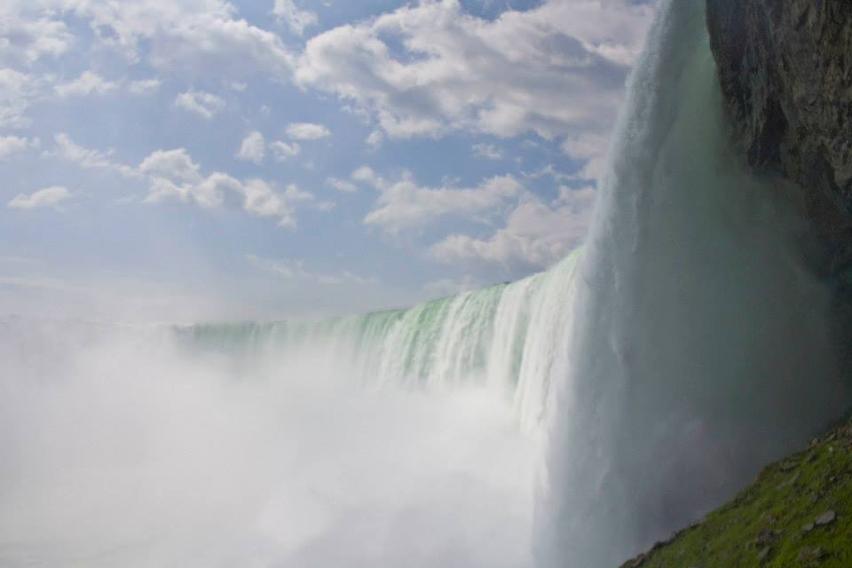

I had always heard about the Falls. But like so many before me, I truly understood the Falls only by standing right next to the crashing waters, its majestic roar and unbridled power engulfing my senses. As I stood there, water splashing over me and mist covering my body, I couldn’t help but close my eyes and simply allow myself to be overwhelmed. Water. So tame when coming out of the faucet into my hands. So fierce and uncontainable here in this moment.

As I look back, the two words that Niagara invoke are: beauty and power. Sunbeams reflecting off the mist produce glistening rainbows (and yes, even double rainbows) over the waters. Niagara is a very sensory experience. Sight. Sound. Touch. Close your eyes and you hear the roar of thousands of lions. Open them and you see the wonderful handiwork of receding glaciers from ages past. 

I wonder what the first humans to stumble upon the mighty Falls felt. Their response must have been similar to mine: silent awe. Granted, Niagara is much more commercialized now. However, take away everything except the rushing waters and it’s hard to imagine even the most jaded person having any other response. Niagara has that special ‘something’. And this ‘something’ plucks at my heartstrings. A yearning for adventure, for a land far, far away, for things I can’t quite articulate. 

Perhaps that’s what beauty does to you:

**It renders you speechless.**

