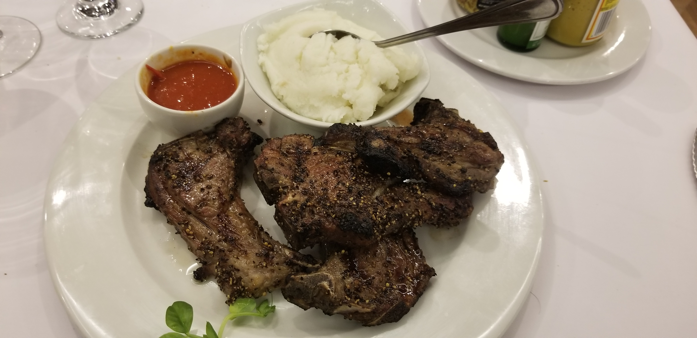
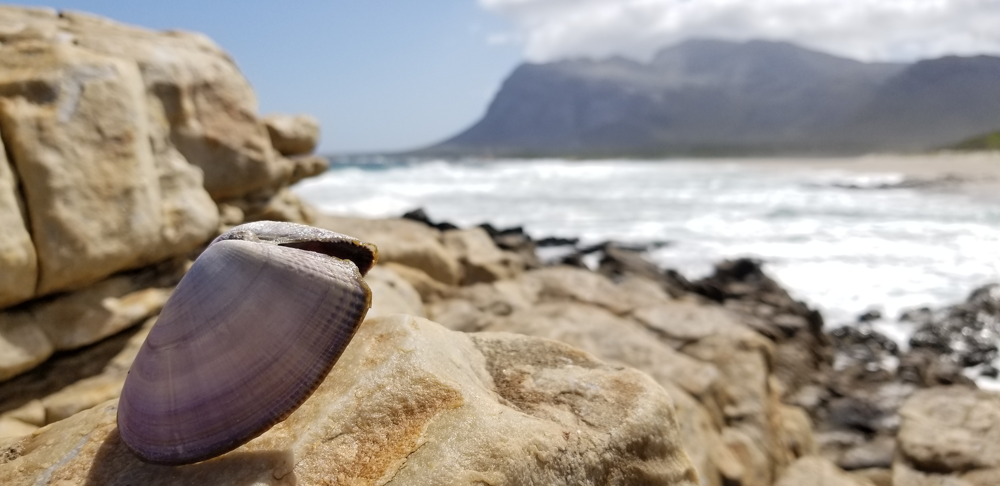
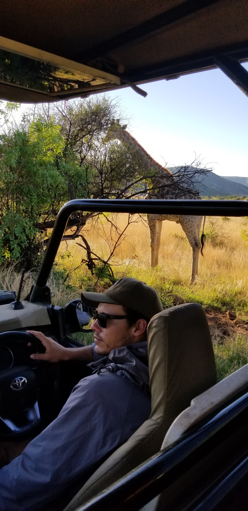
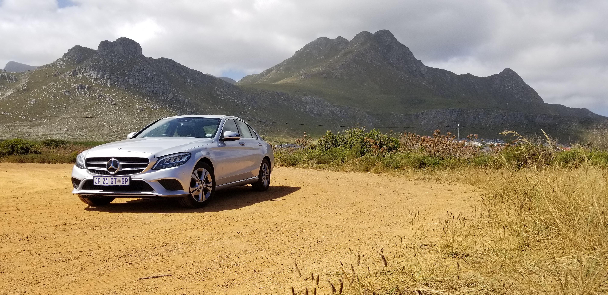
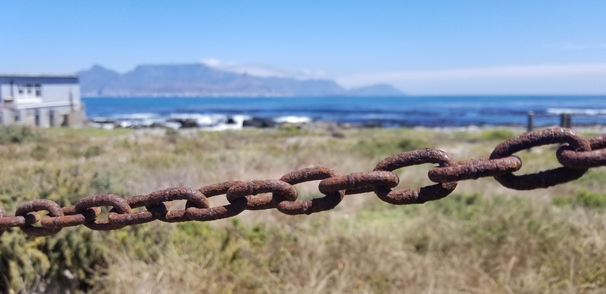
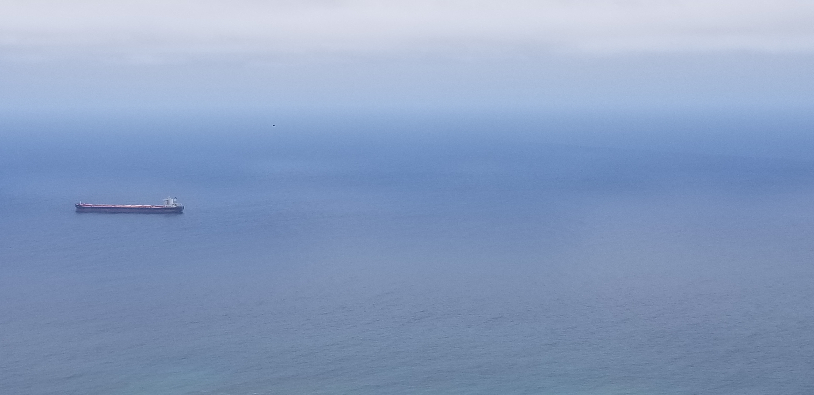
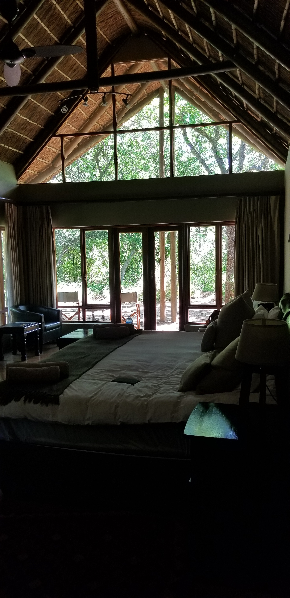

Two friends and I flew        
Into a land of beauty -         
Penguins on the beach!           

Barbeque or braai      
Lamb seared to sweet perfection            
Am I in heaven?                  

Seashells by the beach       
Waves crash, mussels grow, splish splash         
Sand gets in my toes        

The best time to think      
Is on a safari ride       
Lions, giraffes, pause           

Benz thinking of you        
Soft breeze, gentle gaze, warm touch           
Let's take a road trip              

I'm free, or am I?       
Do I still hate, I wonder       
Teach me how to fly  

The calm blue, vast sea      
Secrets I've kept, buried deep        
Float along, my ship

Dash, slide, I jump up     
Falling onto silken sheets     
Sleep, how I've missed you              
