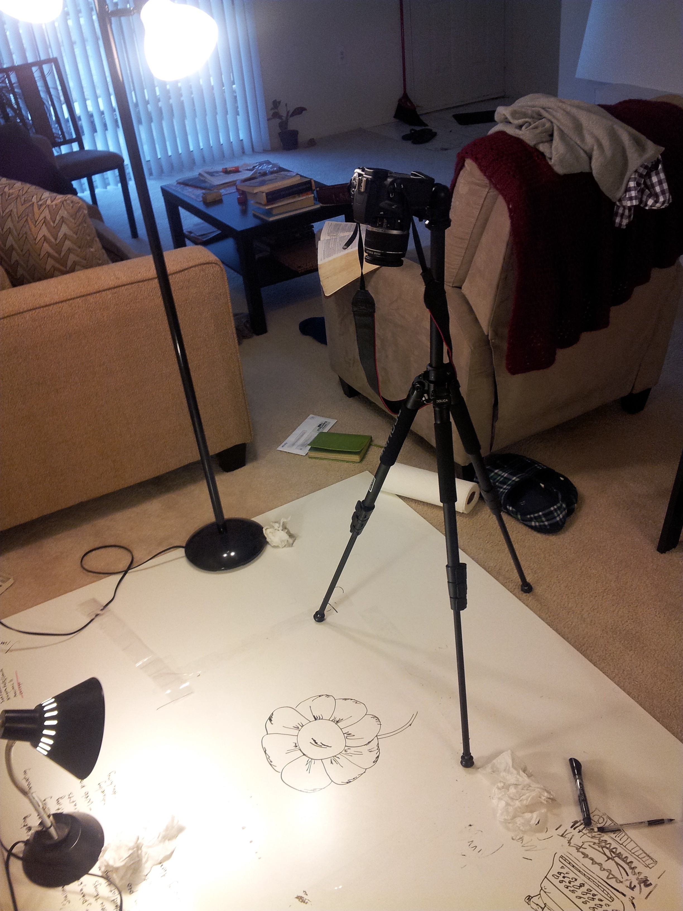



When my friend Aiswarya told me about a video contest held by the National Academy of Engineering in commemoration of their 50th anniversary, I knew I had to do it. The goal was to make a video highlighting engineering innovations and how they enhance quality of life and serve society. Only problem was, the deadline was a week away (since we discovered the contest late). But I’ve always been interested in making videos, so I accepted the challenge. I had previously seen whiteboard animations on YouTube and wanted to try my hand at it, so I decided on the medium for the video.

For the theme, I wanted to show how technology has helped people connect over the years. From the typewriter to the computer to cell phones and apps to the growing potential of virtual/augmented reality, great technology always bridges the gap between people — allowing us to empathize with each other. After all, I think one of a person’s deepest desires is not so much to be fixed as it is to be understood. So I wanted to capture the connection and closeness that technology allows.

I already had a whiteboard, markers, and camera. I borrowed a tripod from my friend Tianbo and completed my setup (pictured above). So on a Wednesday (March 26th) evening I started, hoping I could finish by the Monday (March 31st ) deadline. I whispered a prayer for drawing skills and creativity, took a black dry-erase marker in hand, and started.

The drawing and photography took till the end of Saturday (I now sympathize with and greatly admire the animators who breathed life into my favorite classic Disney animations). Then I needed to work on the soundtrack. I took my guitalele and looped 4 chords into the recording software. I timed the music tempo to match the video frame rate and started adding other sonic layers to the soundtrack. Music comes easier to me than drawing, so I was able to finish the soundtrack on Sunday afternoon.

Finally, it was time to edit the pictures and make the video. Since I didn’t have Lightroom to batch edit,I had to edit the pictures individually in Photoshop (next time I will definitely not do that!). But time was scarce and this had to be done, so I created some shortcuts in Photoshop to make editing easier and got to work. A couple of hours later, I was done (albeit bleary-eyed and exhausted). I sent the video to my friends for a final look-through and passed out. I submitted the video on Monday evening; what a satisfying feeling!

Completing this video was an exercise in endurance; by the grace of God I was able to finish in time with a video I’m proud of. Having time to spend on the project only after work and on the weekend meant I had to be efficient. Since I had never done anything like this before, I didn’t know if it was possible to complete a stop-motion video in less than a week. But sometimes, not knowing the line between ‘possible’ and ‘not possible’ helps you attempt and do the impossible. At least that’s how I felt after finishing!

